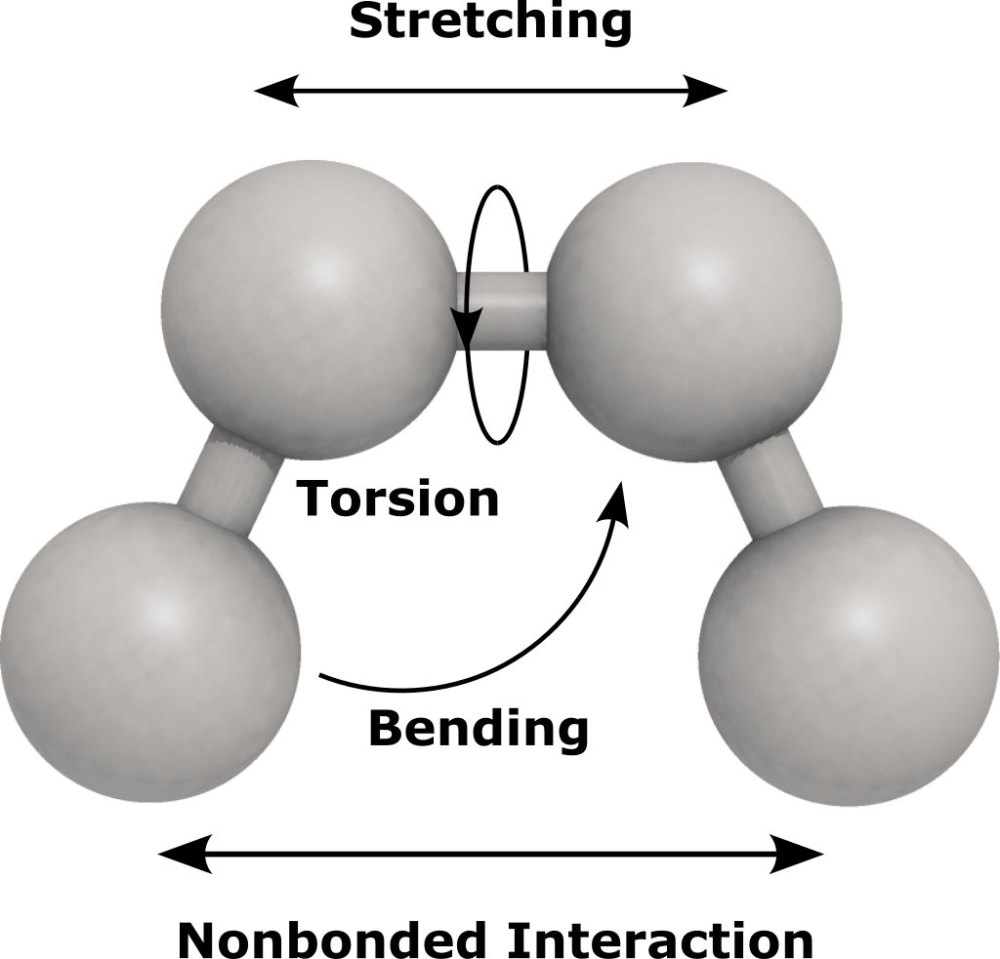

# Force Field
A force field is an algorithm that is used to calculate potential energy for the 
modeled compounds. In JMolecular Energy the force field is represented with `ForceField` 
abstract class where all the force fields should extend this class. The class offer
methods that is intended to contain certain functionalities.

## Assigning Parameters
Empirical force fields most of the time assign parameters to the molecule based on
the functional groups and atoms it has. This will facilitate calculating the potential
energy for the molecule in the next step. Assigning parameters can be done using this method
```java
mmff.assignParameters(atomContainer);
```

## Energy Component
Each `ForceField` contains one or more of the `EnergyComponent`. These components
are intended to address different energy terms such as bond stretching, angle bending
and intermolecular interactions.

Each one contribute to the total potential energy of the system by certain energy.
 The class `ForceField` sums up this energy in the `double calculateEnergy(IAtomContainer)` 
method and return it as a `double`. You can access the energy components in a certain
 force field using the method `List<EnergyComponent> getEnergyComponents()` which returns
 a list of energy component. The `ForceField` class is flexible and you can add or remove
 `EnergyComponent` using the method `addEnergyComponent(EnergyComponent)` and
 `removeEnergyComponent(EnergyComponent)`. This allows for example to convert a force field
 into inter- or intra-molecular interactions only which is very helpful when using
 the force field in a docking or 3D QSAR algorithm.

Energy components can be used alone to calculate the potential energy term alone as they
 have their `double calculateEnergy(IAtomContainer)` method. The implementations 
also have methods to calculate energy for a certain pair of atoms for example.

## Energy Unit
The `ForceField` use the kcal/mol unit by defualt. In case you want to calculate 
the energy in different unit you can use the `setEnergyUnit(EnergyUnit)` method for changing
the unit. For example:
```java
forcefield.setEnergyUnit(EnergyUnit.KJ_PER_MOL);//for kilojoules/mol
```

## Cutoff Distance
In some force fields it is possible to specify a cutoff distance that defines the
 distance in angstrom which beyond it any non-bonded interaction will be disregarded.
 Using this functionality is very helpful in case of large systems where the number of intermolecular
 interaction is very high. The energy beyond certain distance is very small and have 
no significant amount and therefore can be disregarded.
```java
forcefield.setCutoffDistance(12);//sets the cutoff distance to 12 Å
```

## Dielectric Constant
Some force fields also has the dielectric constant functionality. This option enable
 us to simulate the effect of certain solvents on the degree of intermolecular interaction
 without the need the having the solvent molecules being modeled explicitly. The solvent
 is represented as a continuous media rather than individual molecules. You can modify the
 dielectric constant using `setDielectricConstant(double)` method.

